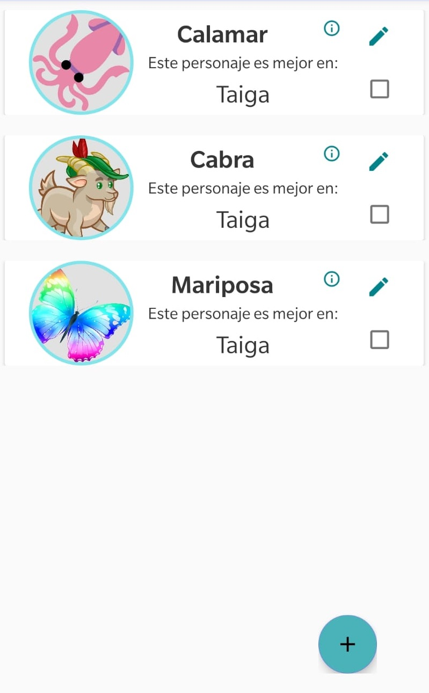
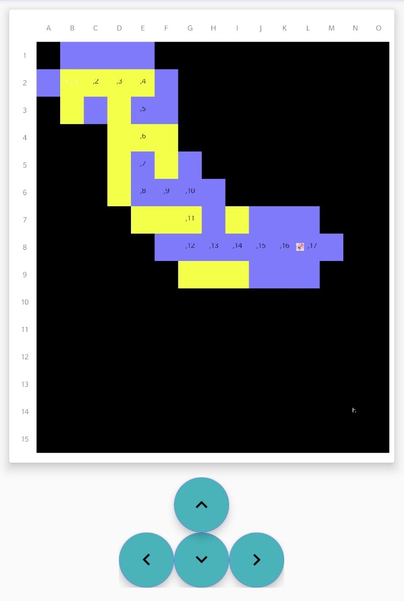
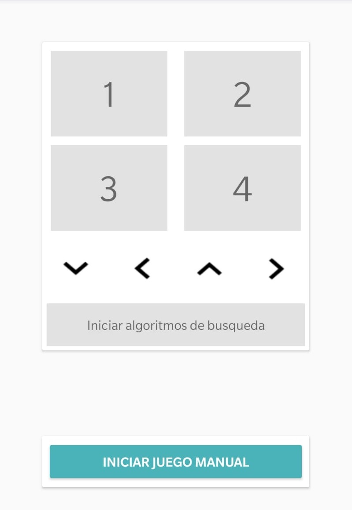

### Versión en español
>[Click here to go to the english version of this .readme.](###English-version)

# Laberinto Multinivel

## Indice
* [Descripción](##Descripción)
* [Instalación](##Instalación)
* [Uso](##Uso)
* [Documentación](##Documentación)
* [Autores](##Autores)

## Descripción
Laberinto Multinivel es un aplicación Android que permite ya sea jugar en el laberinto de su elección o resolver un laberinto de forma automática y luego estudiar pasos de resolución.

## Instalación 
### Android Studio
Android Studio es el IDE que hemos elegido para desarrollar nuestra aplicación. Es una poderosa herramienta para crear aplicaciones para
plataformas bajo Android.

El primer paso de instalación es descargar el instalador desde el [sitio de desarrollo de Android](https://developer.android.com/studio/).
Después de seleccionar rápidamente la configuración de instalación y la ubicación de los archivos así como si o no es necesario instalar el emulador android (útil si no se dispone de dispositivo android), se realiza la descarga.

Podemos en teoría empezar a programar ahora. Sin embargo, utilizamos para nuestra aplicación un Software Development Kit (SDK) que no está presente en Android Studio. Por lo tanto, antes de comenzar nuestro proyecto, tenemos que ir a la pestaña "configure" para descargar la versión del SDK que nos interesa ; en nuestro caso, la versión Android Pie que corresponde a el API 28.

### Descargue el proyecto con git y ejecútelo

1. Cargue Android Studio y seleccione Comprobar proyecto desde Control de versiones. 

2. Seleccione GitHub de la lista desplegable.

3. Inicie sesión con su cuenta de GitHub.

4. Rellene el formulario Clone Repository Clone : Complete los siguientes elementos
	* Vcs Repository URL: La URL de tu repositorio en GitHub
	* Parent Directory : El directorio local donde desea almacenar este proyecto.
	* Directory Name : El nombre de tu proyecto

5. Abrir el proyecto
	* Aparecerá un mensaje que le preguntará si desea abrir el proyecto en Android Studio.
	Haz clic en Sí.
	* El proyecto ahora se abrirá en Android Studio
	
## Uso
 |  | 
--- | --- | --- 
texte1 | texte2 | texte3

 |  
--- | --- 
texte4 | texte5
## Documentación
Puede encontrar toda la documentación de la aplicación [aquí](https://launderex619.github.io/laberinto-multinivel/).

## Autores
* Carlos Carvajal Vazquez
* Jose Alejandro Silva Moya
* Florent Bonnafous
* César Perrin-Cocon

### English version

## Indice
* [Description](##Description)
* [Instalation](##Instalation )
* [Usage](##Usage)
* [Documentation](##Documentation)
* [Autors](##Autors)

# Multilevel Labyrinth

## Description
Multilevel Labyrinth is an Android application that allow one either to play in the labyrinth of his choice with the character of his choice or resolve a labyrinth automatically and then study the steps of resolution.

## Installation
### Android Studio 
Android Studio is the IDE we have chosen for developping our application. It's a powerful tool to create application for Android supporting devices.

The first step of the installation is downloading the installer which can be done on [the Android downloading website](https://developer.android.com/studio/). After quickly selecting the configurations of installation and the files location as well as if you need or not to install the android emulator (usefull if you don't have a an android device for testing your programm), the download begins.

En theory, we can begin to code now. However, we are using for our application a Software Development Kit (SDK) that is not initially present in Android Studio. Therefore, before stazrting our project, we must go into the "configure" panel in order to download the SDK version which interests us ; in our case, the Pie Android Version which corresponds to the API 28.

### How to clone a GitHub project on Android Studio

1. Load Android Studio and select Check out project from Version Control

2. Select GitHub from the drop down list

3. Enter your GitHub credentials. Then click Login

4. Fill out the Clone Repository form and click Clone : Fill out the following items
	* Vcs Repository URL: The URL of your repository on GitHub
	* Parent Directory : The local directory where you want to store this project
	* Directory Name : The name of your project
	
5. Open the project
	* You will be prompted with a message asking you would like to open the project in Android Studio. 
	Click Yes.
	* The project will now open in Android Studio 

## Usage
 |  | 
--- | --- | --- 
texte1 | texte2 | texte3

 |  
--- | --- 
texte4 | texte5

## Documentation
You can find all the documentation about our application [here](https://launderex619.github.io/laberinto-multinivel/)

## Autors
* Carlos Carvajal Vazquez
* Jose Alejandro Silva Moya
* Florent Bonnafous
* César Perrin-Cocon
